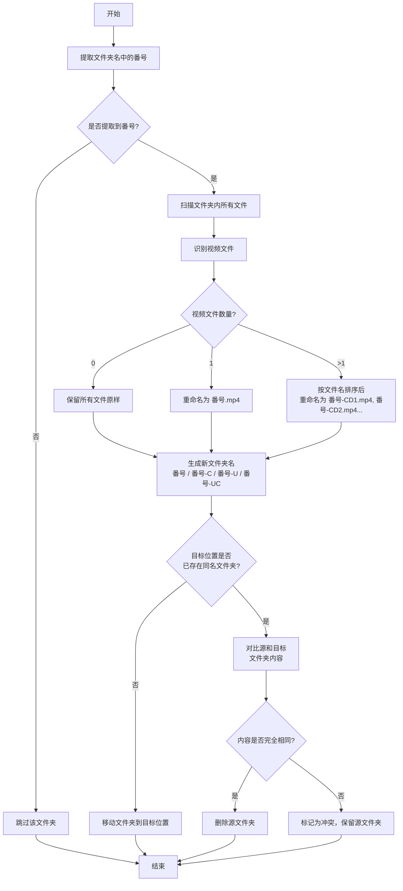

# jav-organizer

JAV 文件整理工具

## 功能特点

- 支持主流番号格式提取
- 支持从后向前部分匹配
- 自动识别中文字幕 (-C)、无码 (-U)、中文无码 (-UC)
- 多视频文件识别 CD 顺序
- 并行处理多个文件夹
- 目标文件夹已存在时自动检测冲突
- 支持 **Server 模式**：后台定时循环执行整理任务

## 使用方法

### 单次运行

```bash
# 基本用法
jav-organizer -s <源文件夹> -t <目标文件夹>

# 指定并发数
jav-organizer -s /path/to/source -t /path/to/target -c 10
```

### Server 模式

启动后不退出，按指定间隔循环执行整理任务。首次启动立即执行一次。

```bash
# Server 模式（默认间隔 15 分钟）
jav-organizer -s /path/to/source -t /path/to/target --server

# 自定义间隔（分钟）
jav-organizer -s /path/to/source -t /path/to/target --server --interval 10
```

### 环境变量

也支持通过环境变量配置：
- `JAV_SOURCE`: 源文件夹路径
- `JAV_TARGET`: 目标文件夹路径
- `JAV_CONCURRENCY`: 并发数 (默认 5)
- `JAV_INTERVAL`: Server 模式间隔分钟数 (默认 15)

### 进程信号

Server 模式下支持以下信号优雅退出（当前轮次完成后退出）：
- `SIGINT` (Ctrl+C)
- `SIGTERM`

## 单文件夹处理流程



## 本地开发

```bash
npm install
npm test
npm start -- -s <源文件夹> -t <目标文件夹>
```

## Docker 使用

```bash
# 构建镜像
docker build -t jav-organizer .

# 单次运行
docker run -v /path/to/source:/source -v /path/to/target:/target jav-organizer -s /source -t /target

# Server 模式
docker run -v /path/to/source:/source -v /path/to/target:/target jav-organizer -s /source -t /target --server --interval 15
```

## Docker 镜像

镜像发布在 GitHub Container Registry:
- `ghcr.io/{owner}/jav-organizer:latest`
- `ghcr.io/{owner}/jav-organizer:{version}`

## 发布流程

```bash
git tag v1.0.0
git push origin v1.0.0
```
